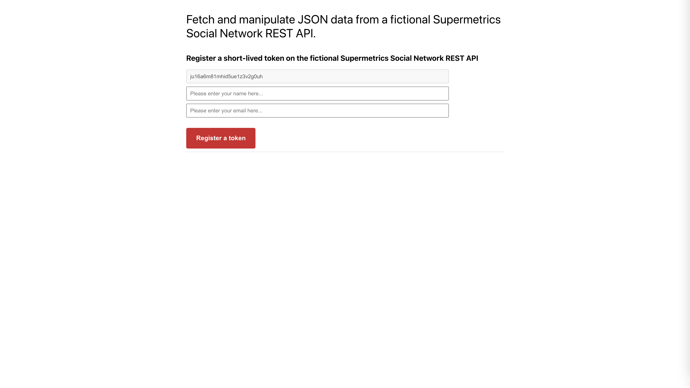
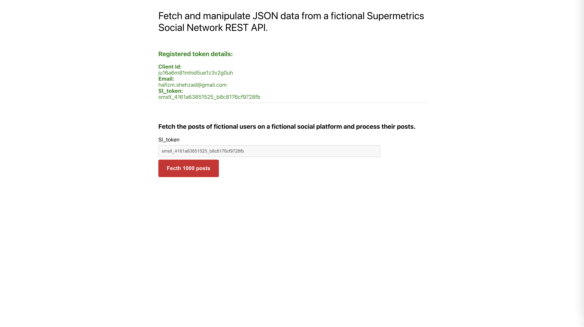
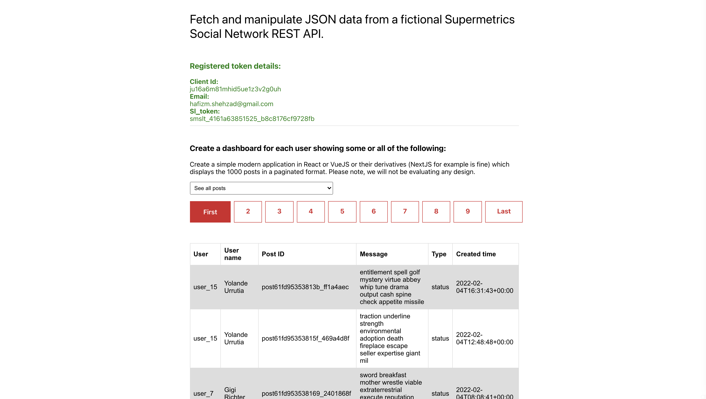
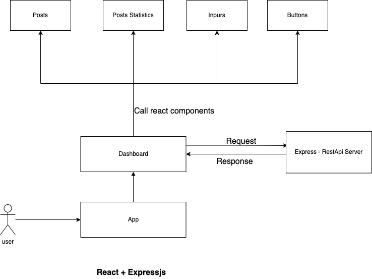

# Tasks

###### Register a short-lived token on the fictional Social Network REST API

###### Fetch the posts of fictional users on a fictional social platform and process their posts.

###### You will have 1000 posts over a six month period.

###### Create a simple modern application in React or VueJS or their derivatives (NextJS for example is fine) which displays the 1000 posts in a paginated format. Please note, we will not be evaluating any design.

###### Create a dashboard for each user showing some or all of the following: a. The number of posts each person made in total

- The number of posts each person made in total
- Average number of characters of their posts
- The number of posts each person made every month
- Each person’s longest post.

###### Design your thinking and code to be generic, extendable, easy to maintain by other staff members while thinking about performance

---

##### Fetch the sl_token

- **Required params:** client_id, username and email
- **Return values:** client_id, email and sl_token

> 
> 

##### Fetch using sl_token and added pagination

- **Required params:** sl_token
- **Return values:** posts

> 

##### Create a dashboard for each user showing some or all of the following: a. The number of posts each person made in total

There is one dropdown box for checking the posts-statistics. There are all the 4 requested options available whenever you select those options other than `see all posts`. It update the table content view and show table like this.

> 

##### How it works?

